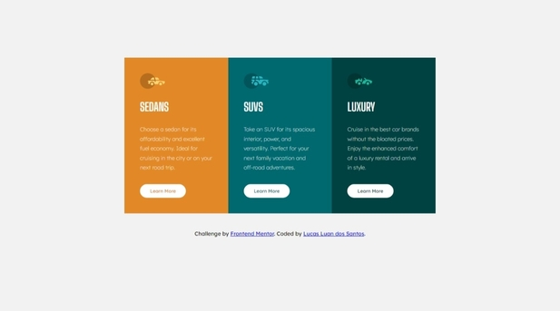

# Frontend Mentor - 3-column preview card component solution

This is a solution to the [Three column preview card component challenge on Frontend Mentor](https://www.frontendmentor.io/challenges/3column-preview-card-component-pH92eAR2-). Frontend Mentor challenges help you improve your coding skills by building realistic projects. 

## Table of contents

- [Overview](#overview)
  - [The challenge](#the-challenge)
  - [Screenshot](#screenshot)
  - [Links](#links)
- [My process](#my-process)
  - [Built with](#built-with)
- [Author](#author)

## Overview

### The challenge

Users should be able to:

- View the optimal layout depending on their device's screen size
- See hover states for interactive elements

### Screenshot

### Links

- Solution URL: [Solution URL here](https://github.com/lucasluan01/frontend-mentor/tree/main/html-css/newbie/three-column-preview-card-component)
- Live Site URL: [Live site URL here](https://three-column-preview-card-component-lucasluan01.vercel.app)

## My process

### Built with

- Semantic HTML5 markup
- CSS custom properties
- Flexbox

## Author

- Frontend Mentor - [@lucasluan01](https://www.frontendmentor.io/profile/lucasluan01)
- Linkedin - [Lucas Luan dos Santos](https://www.linkedin.com/in/lucas-luan-dos-santos)
- GitHub - [lucasluan01](https://github.com/lucasluan01)